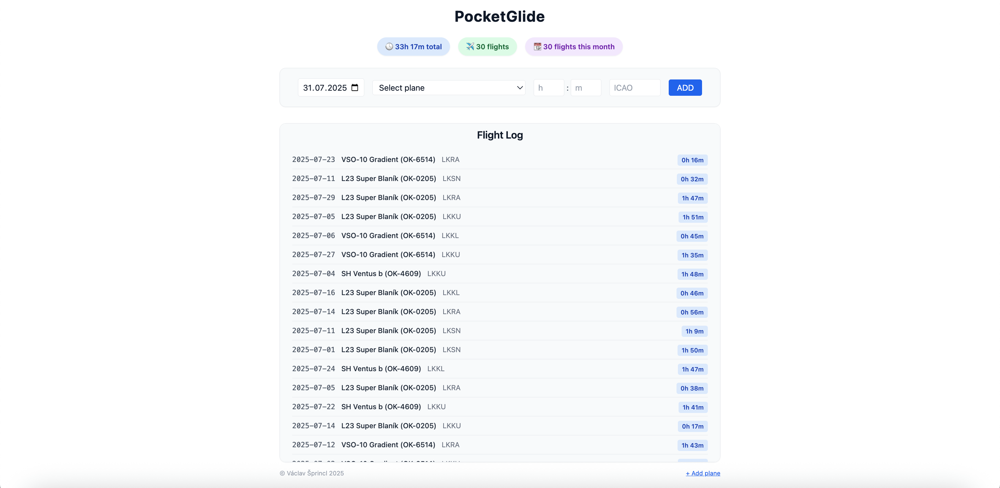

# PocketGlide

PocketGlide is a simple, web-based logbook for glider pilots.  It runs on Python using Bottle and TinyDB


## Basic functions

- Log flights with date, aircraft, airtime, and airport
- Track total airtime and flight count
- Password protection via cookie-based login




## Installation

1. Clone the repository:
```bash
git clone https://github.com/vskpsk/pocketglide.git
cd pocketglide
```

2. Install all dependencies:
```bash
pip install -r requirements.txt
```

3. Set environment variable (create .env):
```ini
MASTER_PASSWORD=your_secure_password
```

3. Run the app:
```bash
python3 app.py
```

### Update log
- v1.2 - New edit function, form for adding planes moved, minor tweaks
- v1.1 - Standalone web-app for phones. Added remove function for flights. new logs
- v1.0 – Initial release